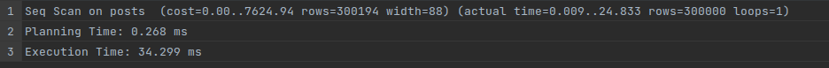

## Start celery
```python
celery -A utils.tasks worker --loglevel=INFO
```
## Migration
#### autogenerate migration
```python
alembic revision --autogenerate -m "<commit>"
```
#### accept migration
```python
alembic upgrade head
```
## Generate 1000000 users
```python
python -m database.generation
```
## Run program
```python
python -m run
```


## Time to get all posts (300000 items)
